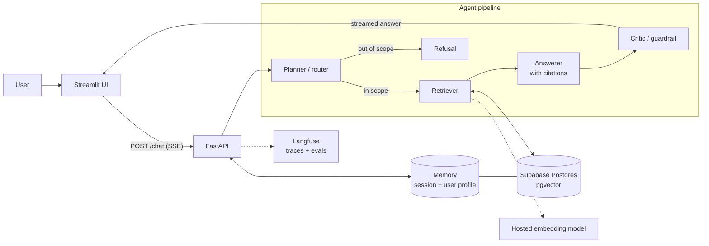

# FDE Starter Kit

[](https://github.com/sandeepjunaghare/FDEStarterKit/actions/workflows/ci.yml)

A retrieval-augmented (RAG) assistant built as a four-agent pipeline that answers only from your documents, cites its sources, and refuses what is out of scope.

**Stack:** Claude Agent SDK · FastAPI (SSE) · Supabase Postgres + pgvector · Streamlit · Langfuse · Docker → Render

> **Status:** the API skeleton, Supabase connection and health checks are built and tested. The agents, retrieval, memory, UI and evals below are the target design and land incrementally. Each section marks what exists today.

---

## Architecture



| Component | Choice | Why |
|---|---|---|
| Orchestration | Planner → Retriever → Answerer → Critic | Each agent has one job; the critic is the last gate before the user |
| Framework | Claude Agent SDK, FastAPI with SSE | Outputs are checked against Pydantic schemas, so guardrails live in code, not prompts |
| Vector DB | pgvector on Supabase | One managed Postgres holds vectors and user memory, identical locally and on Render |
| Embeddings | One hosted model (dimension and cost stated in config) | Hosted beats local for a prototype; swapping is one config line |
| Memory | Session (conversation) + persistent (user profile in Postgres) | Two layers, scoped per user, both visible in the UI |
| Guardrails | Pydantic schemas, scope classifier, PII redaction, required citations, out-of-scope refusal, one domain rule | The cost of a wrong answer decides how strict to be |
| Front end | Streamlit | Fastest path to a usable chat UI with citations and memory on screen |

Full decision log: [`research/tech-stack.md`](research/tech-stack.md).

### Repository layout

```
api/                  FastAPI service (Render web service)
  main.py             app, DB pool lifespan, health + smoke routes ✅ built
  config.py           settings from environment                   ✅ built
  db/                 pool, health probe, smoke, SQL migrations   ✅ built
  tests/              pytest (unit + Supabase integration)        ✅ built
  agents/ schemas/ guardrails/ memory/ rag/                       ⏳ planned
ui/                   Streamlit app (second Render service)       ⏳ planned
evals/                golden set + eval runner                    ⏳ planned
scripts/check_db.py   standalone Supabase + pgvector check        ✅ built
scripts/smoke.sh      deploy smoke test for any URL               ✅ built
render.yaml           Render Blueprint                            ✅ built
docker-compose.yml    local container run                         ✅ built
```

---

## Run

### Prerequisites

- [uv](https://docs.astral.sh/uv/) (Python 3.12 is installed automatically)
- Docker (optional, to run in a container)
- A Supabase project with the `vector` extension enabled (Database → Extensions → `vector`)

### 1. Configure

```bash
cp .env.example .env   # .env is gitignored
```

Set `DATABASE_URL` (Supabase → Connect → Direct → **Session pooler**, port 5432). The other keys in [`.env.example`](.env.example) are only needed as the agents, evals and UI land.

Use the **session pooler**, not the direct connection: the direct host is IPv6-only on the free plan and fails from Docker and Render.

### 2. Check the database

```bash
uv run --script scripts/check_db.py
```

Expected: `PASS` for connect, extension and a vector round-trip, then `OK: Supabase + pgvector ready`.

### 3. Apply migrations

```bash
cd api && uv run python -m db.migrate
```

Applies each file in `api/db/migrations/` once, in order (re-running is a no-op). Local and Render share the same Supabase database, so this only ever runs from your machine. Every table has row-level security enabled, which keeps it out of Supabase's public REST API.

### 4. Start the API

```bash
cd api
uv sync
uv run uvicorn main:app --reload
```

Or in Docker, from the repo root:

```bash
docker compose up --build
```

### 5. Verify

```bash
scripts/smoke.sh            # defaults to http://localhost:8000
```

| Check | Route | Proves |
|---|---|---|
| health | `GET /health` | the process is up |
| version | `GET /version` | which git commit is deployed (`local` outside Render) |
| health/db | `GET /health/db` | Supabase is reachable and pgvector is installed |
| smoke | `POST /smoke` | insert, read-back and vector similarity search on a real table, in one transaction that is rolled back, so nothing persists |

Failures return **503** with the error class only (`UndefinedTable` means migrations haven't run). The API still starts when the database is down, so the failure is reported rather than crash-looping.

### Tests

```bash
cd api
uv run pytest                  # unit tests, database stubbed, no network
uv run pytest -m integration   # against the real Supabase in DATABASE_URL
```

### Lint and type-check

```bash
cd api
uv run ruff check . ../scripts           # lint (add --fix to auto-fix)
uv run ruff format --check . ../scripts  # formatting
uv run pyright                           # type-check (standard mode)
```

### CI

[`.github/workflows/ci.yml`](.github/workflows/ci.yml) runs on every push to `main` and every pull request:

| Job | What it runs |
|---|---|
| Lint, type-check, unit tests | ruff check, ruff format --check, pyright, pytest |
| Docker build | builds `api/Dockerfile` (no push), so a broken image fails before Render deploys it |
| Integration tests | `pytest -m integration` against Supabase. Runs only if the `DATABASE_URL` repo secret is set |

To enable integration tests in CI: **Settings → Secrets and variables → Actions → New repository secret**, name `DATABASE_URL`, value = the session-pooler URL.

---

## Eval

> ✅ Harness built (`evals/`, see [`evals/README.md`](evals/README.md)). Per scenario: write the golden set; the API implements `POST /ask`.

| Metric | What it measures | How |
|---|---|---|
| Retrieval hit rate @k | Did retrieval find the passage that holds the answer? | Expected doc + snippet in the top-k chunks; deterministic, survives re-chunking |
| Citations | Does every answer cite something it actually retrieved? | Deterministic |
| Guardrails | Are out-of-scope, PII and domain-rule questions refused/redacted/escalated, and answerable ones not over-refused? | Deterministic |
| Faithfulness | Is every claim supported by the retrieved text? | Claude as judge (Haiku 4.5), structured score + unsupported claims; optional Langfuse traces |

```bash
cd evals
uv run python run.py golden/<scenario>.yaml --target http://localhost:8000
uv run python run.py golden/<scenario>.yaml --only <case-id> --compare results/<earlier>.json   # fix → rerun
```

- **Golden set:** 10–15 question/answer pairs with their source doc + snippet, including out-of-scope, PII and domain-rule cases.
- **Loop:** run, read the failing case's reason, fix the prompt, retrieval or guardrail, rerun just that case, then compare before → after.

---|---|---|
| Retrieval hit rate | Did the retriever return the chunk that holds the answer? | Each golden question lists its source chunk(s); a hit means one appears in the top-k |
| Faithfulness | Is every claim in the answer supported by the cited chunks? | LLM-as-judge, scored and traced in Langfuse |
| Guardrail behaviour | Are out-of-scope and PII-bearing questions refused or redacted? | Golden cases with an expected refusal |

- **Golden set:** 10–15 question/answer pairs with their source chunks, including out-of-scope cases.
- **Loop:** run the evals, find a failing case, fix the prompt, retrieval or guardrail, then re-run to show the score move. Results and traces are in Langfuse for side-by-side comparison.

---

## Deploy

> Step-by-step procedure, troubleshooting, rollback and password rotation: [`docs/runbook-deploy.md`](docs/runbook-deploy.md).

Render builds the Docker image from this repo itself; nothing is built or uploaded from your machine. The service is defined in [`render.yaml`](render.yaml) (a Render Blueprint).

```
local: scripts/smoke.sh   →   git push   →   CI green   →   Render builds api/Dockerfile   →   scripts/smoke.sh <url>
```

### One-time setup

1. Apply migrations from your machine (see Run → step 3).
2. Render → **New → Blueprint** → connect this GitHub repo. Render reads `render.yaml`:

   | Setting | Value |
   |---|---|
   | Service | `fde-api`, Docker, free plan, region `virginia` (next to Supabase us-east-1) |
   | Build | `api/Dockerfile`, context `api/` |
   | Health check | `/health` |
   | Auto-deploy | after GitHub checks pass, only when `api/**` changes |
   | `DATABASE_URL` | entered when prompted: the same session-pooler URL as `.env`; never committed |

   Paste only the URL: no `DATABASE_URL=` prefix, no quotes, no `<placeholders>`. The API refuses to start on any of those, and the deploy log says which. To copy it from `.env` (prints it with the password masked):

   ```bash
   scripts/copy-db-url.sh
   ```

3. When the deploy is live:

   ```bash
   scripts/smoke.sh https://<your-service>.onrender.com latest --wait
   ```

   `--wait` polls until the deploy is up, then runs the checks. `latest` also fails unless the live commit has the same `api/` code as your `HEAD`, so after a push you know the new code is serving, not the previous deploy. (Pushes that don't touch `api/` don't redeploy; `latest` accepts that because the API code is unchanged.)

After that, every push to `main` that touches `api/` redeploys once CI is green.

**Notes**

- `/health` never touches the database, so a Supabase blip can't block a deploy. `scripts/smoke.sh` checks the data path.
- The container listens on Render's `$PORT` (default 8000 locally) and runs as a non-root user.
- Free instances sleep when idle. The first request after a pause can take 30–60 s (the smoke script waits up to 90 s), so warm the URL before a demo.
- The Streamlit UI will be a second service in `render.yaml`, with `API_URL` pointing at this one.
