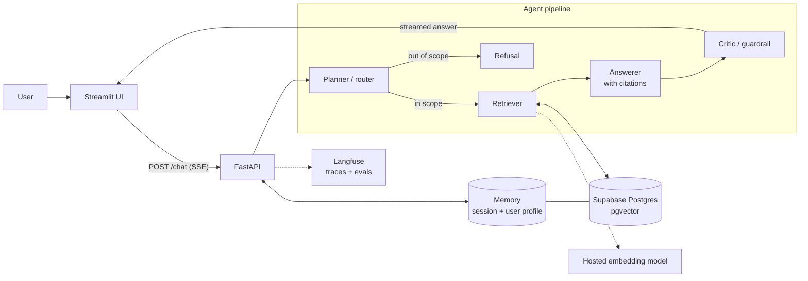

# FDE Starter Kit

A retrieval-augmented (RAG) assistant built as a four-agent pipeline that answers only from your documents, cites its sources, and refuses what is out of scope.

**Stack:** Claude Agent SDK · FastAPI (SSE) · Supabase Postgres + pgvector · Streamlit · Langfuse · Docker → Render

> **Status:** the API skeleton, Supabase connection and health checks are built and tested. The agents, retrieval, memory, UI and evals below are the target design and land incrementally. Each section marks what exists today.

---

## Architecture



| Component | Choice | Why |
|---|---|---|
| Orchestration | Planner → Retriever → Answerer → Critic | Each agent has one job; the critic is the last gate before the user |
| Framework | Claude Agent SDK, FastAPI with SSE | Outputs are checked against Pydantic schemas, so guardrails live in code, not prompts |
| Vector DB | pgvector on Supabase | One managed Postgres holds vectors and user memory, identical locally and on Render |
| Embeddings | One hosted model (dimension and cost stated in config) | Hosted beats local for a prototype; swapping is one config line |
| Memory | Session (conversation) + persistent (user profile in Postgres) | Two layers, scoped per user, both visible in the UI |
| Guardrails | Pydantic schemas, scope classifier, PII redaction, required citations, out-of-scope refusal, one domain rule | The cost of a wrong answer decides how strict to be |
| Front end | Streamlit | Fastest path to a usable chat UI with citations and memory on screen |

Full decision log: [`research/tech-stack.md`](research/tech-stack.md).

### Repository layout

```
api/                  FastAPI service (Render web service)
  main.py             app, DB pool lifespan, health routes        ✅ built
  config.py           settings from environment                   ✅ built
  db/                 async psycopg pool + DB health probe        ✅ built
  tests/              pytest (unit + Supabase integration)        ✅ built
  agents/ schemas/ guardrails/ memory/ rag/                       ⏳ planned
ui/                   Streamlit app (second Render service)       ⏳ planned
evals/                golden set + eval runner                    ⏳ planned
scripts/check_db.py   standalone Supabase + pgvector smoke test   ✅ built
docker-compose.yml    local container run                         ✅ built
```

---

## Run

### Prerequisites

- [uv](https://docs.astral.sh/uv/) (Python 3.12 is installed automatically)
- Docker (optional, to run in a container)
- A Supabase project with the `vector` extension enabled (Database → Extensions → `vector`)

### 1. Configure

Create `.env` in the repo root (it is gitignored):

```bash
# Supabase → Connect → Direct → Session pooler (port 5432). URL-encode special characters in the password.
DATABASE_URL='postgresql://postgres.<project-ref>:<password>@aws-0-<region>.pooler.supabase.com:5432/postgres?sslmode=require'
```

Use the **session pooler**, not the direct connection: the direct host is IPv6-only on the free plan and fails from Docker and Render.

### 2. Check the database

```bash
uv run --script scripts/check_db.py
```

Expected: `PASS` for connect, extension and a vector round-trip, then `OK: Supabase + pgvector ready`.

### 3. Start the API

```bash
cd api
uv sync
uv run uvicorn main:app --reload
```

Or in Docker, from the repo root:

```bash
docker compose up --build
```

### 4. Verify

```bash
curl localhost:8000/health      # {"status":"ok"}                     process is up
curl localhost:8000/health/db   # {"db":"ok","pgvector":"0.8.2"}      Supabase + pgvector ready
```

`/health/db` returns **503** with the error type if the database is unreachable or pgvector is missing. The API still starts in that case, so the failure is reported rather than crash-looping.

### Tests

```bash
cd api
uv run pytest                  # unit tests, database stubbed, no network
uv run pytest -m integration   # against the real Supabase in DATABASE_URL
```

---

## Eval

> ⏳ Planned. The design is fixed; the code lands in `evals/`.

| Metric | What it measures | How |
|---|---|---|
| Retrieval hit rate | Did the retriever return the chunk that holds the answer? | Each golden question lists its source chunk(s); a hit means one appears in the top-k |
| Faithfulness | Is every claim in the answer supported by the cited chunks? | LLM-as-judge, scored and traced in Langfuse |
| Guardrail behaviour | Are out-of-scope and PII-bearing questions refused or redacted? | Golden cases with an expected refusal |

- **Golden set:** 10–15 question/answer pairs with their source chunks, including out-of-scope cases.
- **Loop:** run the evals, find a failing case, fix the prompt, retrieval or guardrail, then re-run to show the score move. Results and traces are in Langfuse for side-by-side comparison.

---

## Deploy

Render builds the Docker image itself from this repo on every push to `main`. Nothing is built or uploaded from your machine.

```
local: docker compose up   →   git push   →   Render builds api/Dockerfile   →   public https URL
```

### API service (one-time setup)

1. Render → **New → Web Service** → connect this GitHub repo.
2. Settings:

   | Setting | Value |
   |---|---|
   | Language | Docker |
   | Branch | `main` |
   | Root Directory | `api` |
   | Health Check Path | `/health` |
   | Environment variable | `DATABASE_URL` (the same session-pooler URL as `.env`) |

3. Create the service, then verify:

   ```bash
   curl https://<your-service>.onrender.com/health/db
   ```

After that, every `git push` to `main` redeploys.

**Notes**

- `/health` never touches the database, so a Supabase blip can't block a deploy. Use `/health/db` to check the data path.
- The container listens on Render's `$PORT` (default 8000 locally) and runs as a non-root user.
- Free instances sleep when idle. The first request after a pause can take 30–60 s, so warm the URL before a demo.
- The Streamlit UI will deploy as a second web service (root directory `ui`), with `API_URL` pointing at this one.
